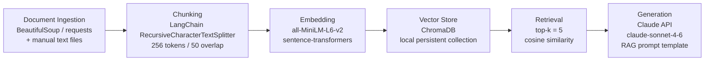

# Project 1 Planning: The Unofficial Guide

> Write this document before you write any pipeline code.
> Your spec and architecture diagram are what you'll use to direct AI tools (Claude, Copilot, etc.) to generate your implementation — the more specific they are, the more useful the generated code will be.
> Update the Retrieval Approach and Chunking Strategy sections if you change your approach during implementation.
> Update this file before starting any stretch features.

---

## Domain

The domain I chose to do this assignment on was student housing. A lot of information about student housing is redundant and recycled, when in reality there are a lot of factors and nuances with specific schools. My document curation is designed to skip all the fluff and take a peek into what living on campus is really like.

---

## Documents

| # | Source | Description | URL or location |
|---|--------|-------------|-----------------|
| 1 | College Dorm Reviews | Crowdsourced student reviews of 6,500+ dorms across 1,400 schools, rated on size, bathrooms, noise, and party scene | https://collegedormreviews.com |
| 2 | The Daily Pennsylvanian | Penn upperclassmen give blunt do's and don'ts to incoming freshmen (hide your food, do laundry early, befriend your hall) | https://www.thedp.com/article/2016/06/new-student-issue-tips-dorm-living |
| 3 | College Confidential | Long thread weighing random vs. self-chosen roommates, with real outcomes from students and parents | https://talk.collegeconfidential.com/t/random-roommate-vs-choosing-roommate/1811434 |
| 4 | College Confidential | Single vs. roommate debate — students candidly weigh privacy against the social/"college experience" tradeoff | https://talk.collegeconfidential.com/t/single-vs-roommate-freshman-year/125580 |
| 5 | AnandTech Forums | Crowd-built list of what to actually bring to a freshman dorm, including overlooked items and roommate coordination tips | https://forums.anandtech.com/threads/things-that-must-be-brought-into-a-freshman-dorm.196580/ |
| 6 | AnandTech Forums | Unfiltered roommate war stories and success stories across multiple years of dorm living | https://forums.anandtech.com/threads/roommates-in-college.833171/ |
| 7 | Amherst Student Blog | Honest one-year-later reflection on what gear got used (noise-canceling headphones, shower slides, command hooks) vs. what stayed in the closet | https://admissionstudentblogs.wordpress.amherst.edu/?p=2911 |
| 8 | Purdue Ambassador Blog | First-person survival advice on roommate communication, shower caddies, and finding study spots outside your room | https://ag.purdue.edu/agry/ambassadorblog/dorm-life-advice |
| 9 | Grown and Flown | Ithaca student's seven things she wishes she'd known — mattress toppers, burnout, prioritizing your own wellbeing | https://grownandflown.com/student-wishes-she-had-known-before-freshman-year-college/ |
| 10 | In The Know / AOL | Roundup of viral TikTok freshman roommate experiences — real red flags and what made some pairings work | https://www.aol.com/lifestyle/college-students-compare-freshman-dorm-183712927.html |

---

## Chunking Strategy

**Chunk size:** 256 tokens *(revised down from 400 during implementation — see note below)*

**Overlap:** 50 tokens

**Final chunk count:** 69 chunks across 10 documents (avg 202 tokens/chunk, max 256). Within the healthy 50–2,000 range.

**Reasoning:** The corpus is made up of short forum posts, student blog entries, and review snippets — not long-form documents. A 256-token chunk is large enough to capture a complete thought or anecdote (e.g., a student's roommate story or a packing tip with context) without splitting it mid-idea. Much smaller chunks (e.g., 100 tokens) would fragment conversational posts and lose the surrounding context that makes student opinions meaningful. The 50-token overlap ensures that key advice that straddles a chunk boundary — a tip that starts at the end of one chunk and concludes at the start of the next — is still retrievable from either side. Splitting is done with LangChain's `RecursiveCharacterTextSplitter`, configured with the `all-MiniLM-L6-v2` tokenizer so token counts are measured against the actual embedding model, and with sentence/paragraph separators so it prefers natural boundaries over hard cuts.

**Note — why 400 became 256:** I originally specced 400 tokens. When I implemented and measured it, two problems surfaced: (1) it produced only **46 chunks**, below the 50-chunk floor that signals chunks are too large for the corpus; and (2) more importantly, `all-MiniLM-L6-v2` truncates input at **256 tokens** (noted in the Retrieval Approach section below), so the back third of every full 400-token chunk would never reach the embedding vector yet would still be returned as context — a silent retrieval bug. Dropping to 256 makes every chunk fit the embedding model exactly (no truncation) and raises the count to a healthy 69, while the chunks still read as coherent, standalone thoughts on manual inspection.

---

## Retrieval Approach

**Embedding model:** `all-MiniLM-L6-v2` via `sentence-transformers`

**Top-k:** 5

**Production tradeoff reflection:** `all-MiniLM-L6-v2` is a strong default for this project — it's fast, free, runs locally, and performs well on short conversational text, which matches the forum/blog nature of this corpus. In a real production deployment with no cost constraint, I'd weigh a few tradeoffs:

- **Accuracy vs. latency:** A larger model like `instructor-xl` or OpenAI's `text-embedding-3-large` would produce higher-quality embeddings, especially for nuanced queries like "what's it really like to share a bathroom with 20 people," but at the cost of slower inference and API fees.
- **Context length:** Some sources (long forum threads) may exceed MiniLM's 256-token input limit, causing truncation. `text-embedding-3-large` supports up to 8,191 tokens, which would better handle longer scraped pages without pre-chunking loss.
- **Domain specificity:** Student slang and informal language are not well-represented in most embedding training sets. A fine-tuned model on student-generated text would improve retrieval precision, though that's rarely practical for a project of this scale.

---

## Evaluation Plan

| # | Question | Expected answer |
|---|----------|-----------------|
| 1 | What do students say about sharing a bathroom with a full dorm floor? | References to communal bathrooms being dirty, the importance of shower shoes/flip flops, and managing hygiene in shared spaces |
| 2 | What items do students most commonly regret not bringing to their dorm? | Shower caddy, mattress topper, command hooks, power strip, and basic first-aid or medicine |
| 3 | What are the biggest roommate conflict triggers according to students who've lived in dorms? | Sleep schedule mismatches, guests/significant others staying over, cleanliness standards, and noise during study time |
| 4 | Is it a good idea to room with your best friend from high school? | Mixed — many students warn it can damage the friendship; others say it worked fine with clear communication upfront |
| 5 | What do students say about staying in your dorm room too much freshman year? | Consistent advice to leave the room — go to the library, dining hall, clubs — because isolation hurts both social life and academic motivation |

---

## Anticipated Challenges

1. **Noisy, off-topic content in scraped forum threads:** Forum sources like AnandTech and College Confidential contain sidebar jokes, off-topic replies, and signature blocks mixed in with genuine advice. This could pollute chunks with irrelevant content and cause the retriever to surface low-quality passages for otherwise valid queries. Mitigation: clean HTML aggressively before chunking, stripping usernames, footers, and quoted reply blocks.

2. **Chunks splitting key advice across boundaries:** Student posts often structure advice as a short setup followed by the actual tip (e.g., "My worst mistake freshman year? Not buying a mattress topper."). A chunk boundary that lands between the setup and the tip makes both halves less useful in isolation. The 50-token overlap helps, but some edge cases will still lose coherence. Mitigation: prefer sentence-boundary-aware splitting over hard token counts where possible.

---

## Architecture

---

## AI Tool Plan

**Milestone 3 — Ingestion and chunking:**
I'll give Claude the Chunking Strategy section and the Documents table and ask it to implement `ingest.py`, which should: (1) fetch/load each source, (2) strip boilerplate HTML, and (3) run `RecursiveCharacterTextSplitter` with `chunk_size=400` and `chunk_overlap=50`. I'll verify output by printing chunk count per source and spot-checking 3–5 chunks manually to confirm they contain coherent, complete thoughts and no HTML artifacts.

**Milestone 4 — Embedding and retrieval:**
I'll give Claude the Retrieval Approach section and the output schema from Milestone 3 and ask it to implement `embed_and_store.py`, which loads chunks, encodes them with `all-MiniLM-L6-v2`, and upserts them into a local ChromaDB collection with source metadata. I'll verify by running the 5 evaluation questions as raw similarity queries and checking that the top-5 returned chunks are topically relevant (not just lexically matching).

**Milestone 5 — Generation and interface:**
I'll give Claude the Evaluation Plan, the Architecture diagram, and the ChromaDB retrieval function signature and ask it to implement `generate.py` with a RAG prompt template that injects the top-5 chunks as context and instructs the Claude API to answer as an "unofficial student guide" — conversational, honest, and grounded only in the retrieved content. I'll verify against all 5 eval questions, checking that answers cite specific student experiences rather than generic advice, and that the system declines to answer when no relevant chunks are retrieved.